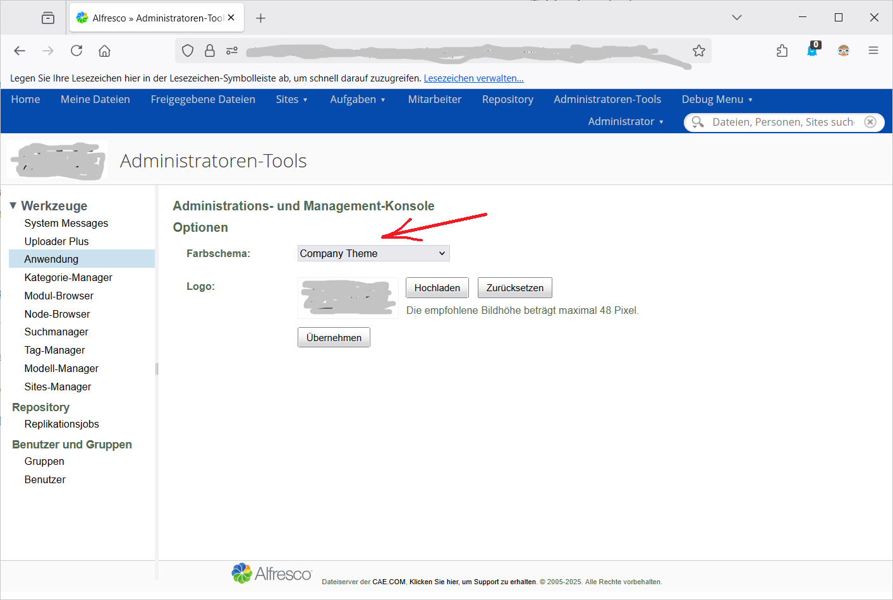
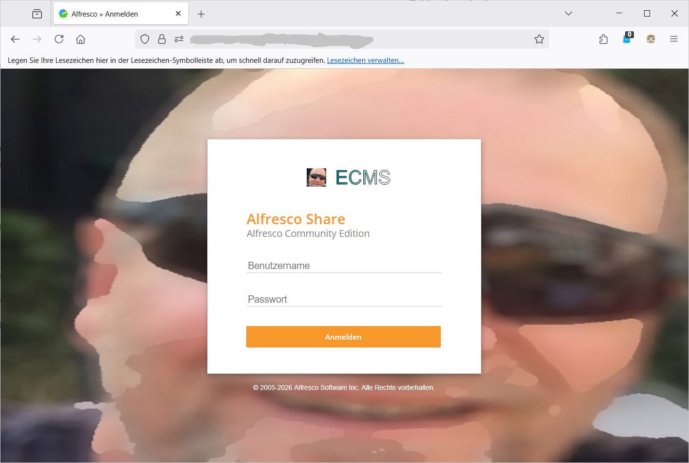

# alfresco-add-company-theme
add a companytheme in blue colors with Loginscreen

#### Zweck:
individueller Anmeldebildschirm mit blauem Theme
#### Voraussetzungen:  
- linux
- maven
#### Konfiguration:
ersetzen der Bilder `company.svg`und `companybackground.png`mit den eigenen Bildern in `src/main/amp/web/themescompanTheme/images/`
#### Ausführung:
  `cd alfresco-add-company-theme`  
  `mvn clean package`
dann die entstandene `target/add-company-theme-1.0-SNAPSHOT.amp` in das share_amp-Verzeichnis kopieren und in Alfresco integrieren
dann Alfresco neustarten und dat Theme aktivieren.
#### Erfahrungen:
- docker
- Alfresco 26.1
#### Screenshots

