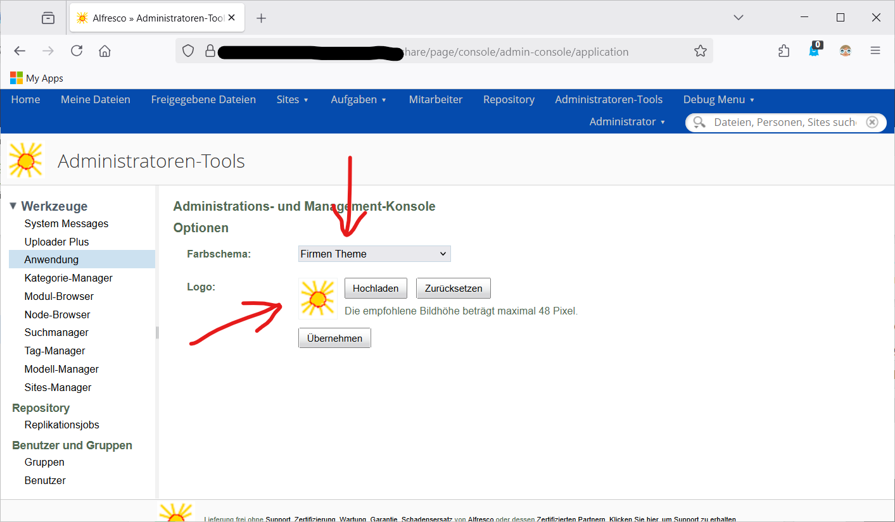
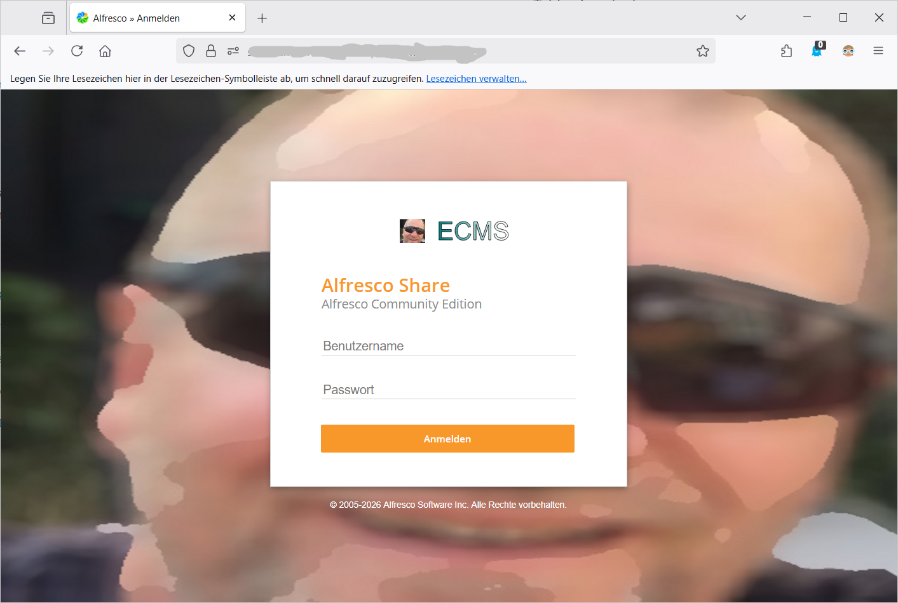
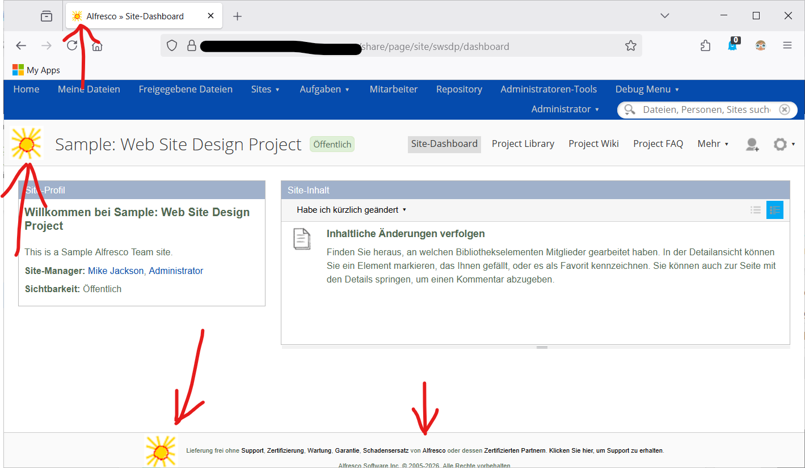

# alfresco-add-company-theme
add a companytheme in blue colors with Loginscreen in share

#### Zweck:
individueller Anmeldebildschirm mit blauem Theme im Share-Bereich
#### Voraussetzungen:  
- linux
- maven
- internetzugang
- lauffähiges Alfresco
#### Konfiguration:
ersetzen der Bilder:  
`company.svg`  
`company-logo-48.png`  
`companybackground.png`  
`favicon.ico`  
mit den eigenen Bildern im Verzeichnis  `src/main/amp/web/themescompanTheme/images/`
#### Ausführung:
dann:  
  `cd alfresco-add-company-theme`  
  `mvn clean package`  
dann die entstandene Datei `target/add-company-theme-1.0-SNAPSHOT.amp` in das jeweilige share_amp-Verzeichnis kopieren und in Alfresco integrieren.  
dann Alfresco neustarten und das Theme aktivieren.
#### Erfahrungen:
- docker
- Alfresco 26.1
#### Screenshots
  
dann zum testen wieder abmelden und Anmeldebildschirm prüfen  

als Ergebnis sollten die neuen Icons zu sehen sein:

